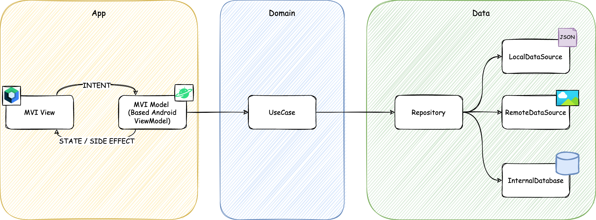
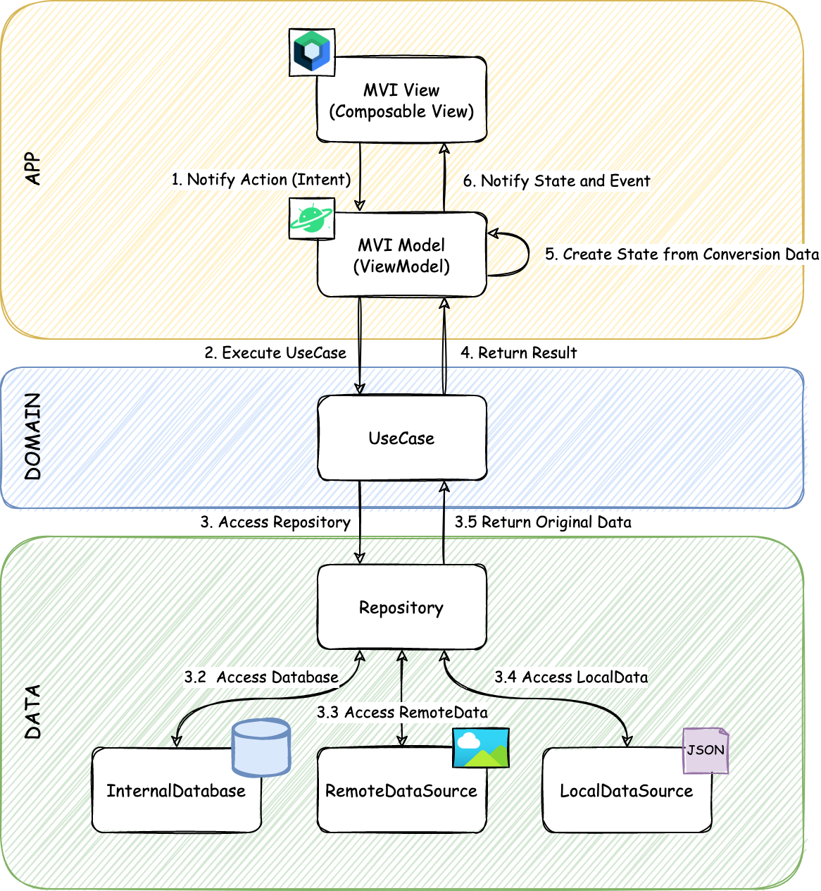

# CatBreedBrowser

This repository contains a Cat Breed Library application that is implemented MVI architecture using
Dagger, Jetpack Compose, Navigation Compose, MVI.

## ✨Features

This application has the following features:

- Display cat image and breed, descriptions.
- Display cat breed details
- Save and display favourites in a list

## 🏢Architecture

This application leverages the MVI (Model-View-Intent) architecture, Clean Onion layered architecture, and the Repository Pattern to ensure a robust and scalable design.

### MVI Implementation

The MVI architecture is implemented using two key components:

1. **IntentProcessor**:
    - This class accepts intents and transforms them into results by invoking use cases, which in turn call repository functions.
    - The results are modeled as sealed classes to represent the output of various operations.

2. **StateReducer**:
    - This component takes the previous state (or initial state) and a result, transforming them into a new state that can be rendered in the UI.

### Dependency Injection

Both the IntentProcessor and StateReducer are injected into the ViewModel. The ViewModel connects these components through a delegate, ensuring unidirectional data flow and clear state transitions without tight coupling between components.

### Benefits

- **Unidirectional Data Flow**: The architecture enforces unidirectional data flow, simplifying state management and ensuring predictable state transitions.
- **Testability**: The separation of concerns and modular design allow individual components and state transitions to be easily tested.
- **Scalability and Maintainability**: By adhering to Clean Onion architecture and the Repository Pattern, the application remains scalable and maintainable, with clear boundaries and responsibilities for each layer.

This approach ensures a maintainable codebase with a clear separation of concerns, making it easier to extend and test the application.



## 💽 DataFlow



## 📦Module
The application is organized to group modules based on features, ensuring related features are contained within the same folder/module. This structure maintains clarity and separation of concerns within the codebase.

### Feature-Based Module Organization

- **Feature Modules**:
    - Each feature module contains its own domain and data layers, encapsulating all necessary components for the feature.
    - This modularization ensures that each feature operates independently, promoting maintainability and scalability.

### Shared Modules

The application also includes shared modules to handle common functionalities and configurations. These shared modules include:

- **Local Room Database**: Centralized setup and configuration for the Room database used across various features.
- **Test Utilities**: Common utilities and configurations for testing, facilitating consistent and efficient test setups.
- **Networking**: Shared networking setup and configurations, ensuring a unified approach to network operations.
- **Design System**: Common design elements and styles, promoting consistency in the application's user interface.

## 📚Library

This application uses the libraries below.

| Name               | Link                                                           |
|--------------------|----------------------------------------------------------------|
| Dagger             | https://dagger.dev/hilt/                                       |
| Jetpack Compose    | https://developer.android.com/jetpack/compose                  |
| Navigation Compose | https://developer.android.com/jetpack/compose/navigation       |
| Coil               | https://coil-kt.github.io/coil/                                |
| Room               | https://developer.android.com/training/data-storage/room?hl=ja |
| Retrofit           | https://square.github.io/retrofit/                             |  

## 📚How to Compile
To compile:
- Obtain an API key from https://thecatapi.com/
- Create credentials.properties file in the root project directory
- Add the API key this format to the credentials.properties file
```properties
CAT_API_KEY=your_actual_api_key
```
- Run with Android Studio Android Studio Jellyfish | 2023.3.1 Patch 1 or later

## 💡License

```
Copyright (c) 2024 Abdul-Mujeeb Aliu

Permission is hereby granted, free of charge, to any person obtaining a copy
of this software and associated documentation files (the "Software"), to deal
in the Software without restriction, including without limitation the rights
to use, copy, modify, merge, publish, distribute, sublicense, and/or sell
copies of the Software, and to permit persons to whom the Software is
furnished to do so, subject to the following conditions:

The above copyright notice and this permission notice shall be included in all
copies or substantial portions of the Software.

THE SOFTWARE IS PROVIDED "AS IS", WITHOUT WARRANTY OF ANY KIND, EXPRESS OR
IMPLIED, INCLUDING BUT NOT LIMITED TO THE WARRANTIES OF MERCHANTABILITY,
FITNESS FOR A PARTICULAR PURPOSE AND NONINFRINGEMENT. IN NO EVENT SHALL THE
AUTHORS OR COPYRIGHT HOLDERS BE LIABLE FOR ANY CLAIM, DAMAGES OR OTHER
LIABILITY, WHETHER IN AN ACTION OF CONTRACT, TORT OR OTHERWISE, ARISING FROM,
OUT OF OR IN CONNECTION WITH THE SOFTWARE OR THE USE OR OTHER DEALINGS IN THE
SOFTWARE.
```
